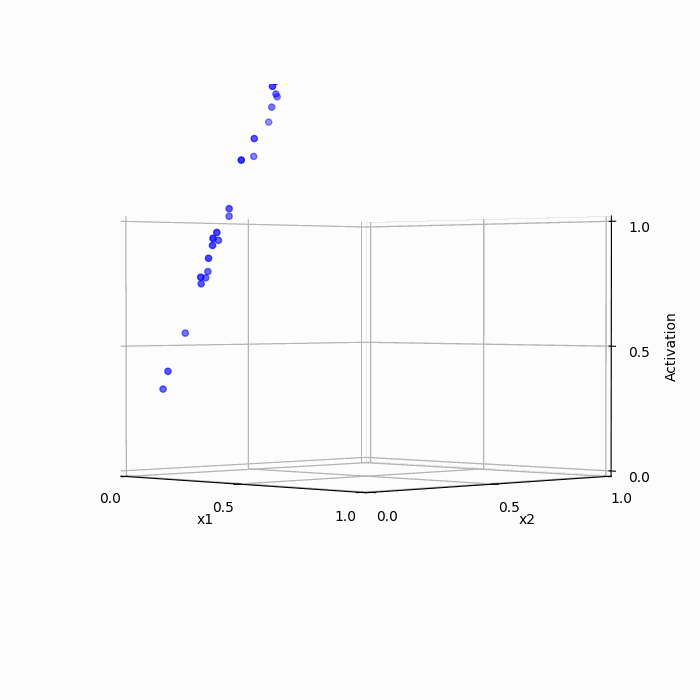
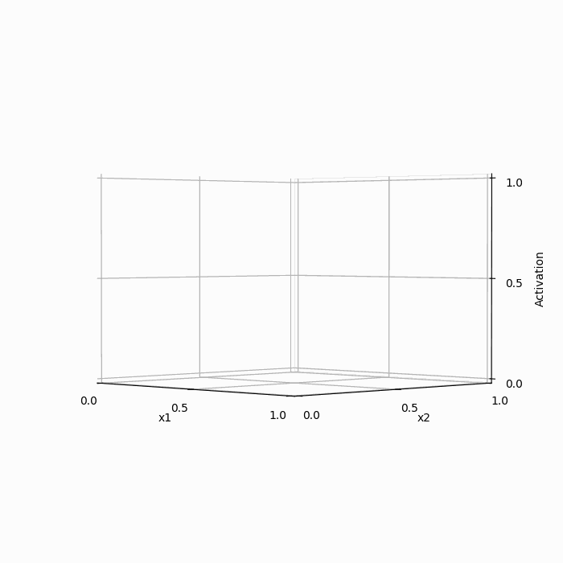
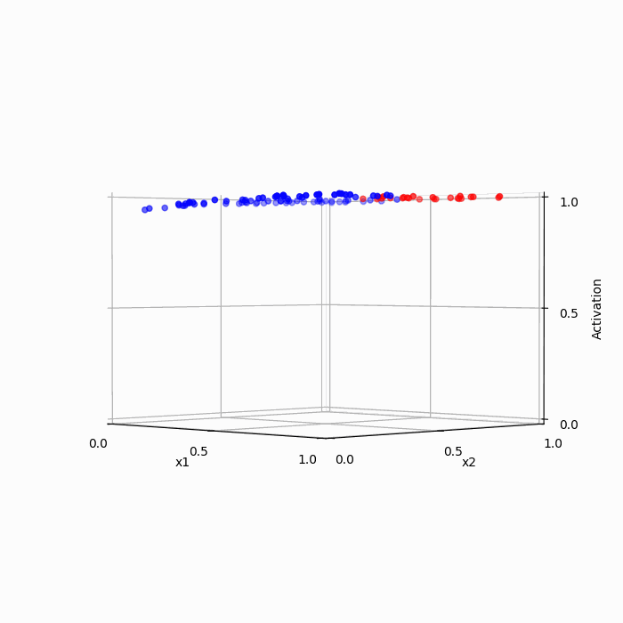
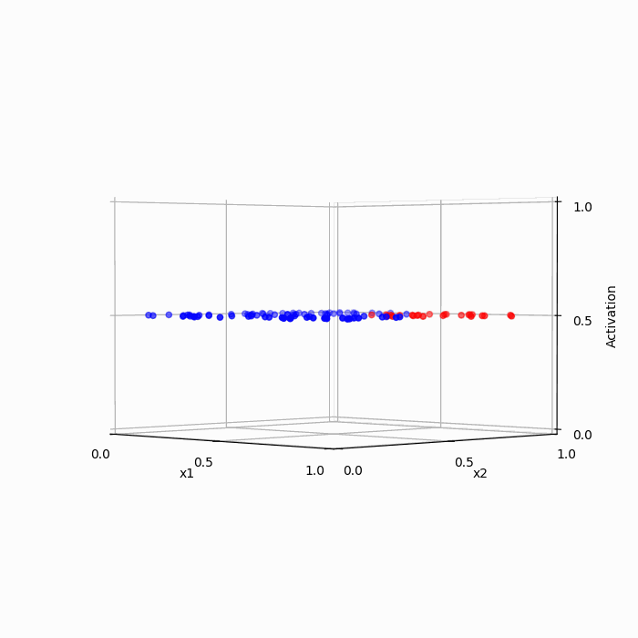

## AND

### Binary

### ReLU

#### weight_init=2.5, learning_rate=0.001, bias=False

#### weight_init=2.5, learning_rate=0.01, bias=False

#### weight_init=2.5, learning_rate=0.001, bias=True

#### weight_init=2.5, learning_rate=0.01, bias=True

### Sigmoid

#### weight_init=2.5, learning_rate=0.1, bias=True

#### weight_init=2.5, learning_rate=0.01, bias=True

#### weight_init=0.0, learning_rate=0.1, bias=True

#### weight_init=0.0, learning_rate=0.01, bias=True

## XOR

#### weight_init=2.5, learning_rate=0.1, bias=False    

